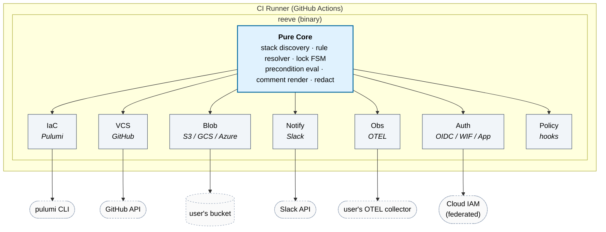

# reeve

**PR-native, self-hosted GitOps orchestrator for Pulumi.** No control plane,
no vendor backend, no telemetry, no account — you own everything.

> Named after the medieval reeve: an official empowered to enforce rules and
> manage an estate on behalf of those who own it. A tool whose entire job is
> to enforce approval policy, manage locks, and act on infrastructure on
> behalf of the team — while owning none of it.

---

## What reeve does

`reeve` is a single Go binary you drop into your CI. On a PR it:

1. Runs `pulumi preview` for every stack touched by the changed files.
2. Posts a single PR comment with per-stack change counts and a collapsible
   plan — edited in place on every push.
3. Gates `/reeve apply` behind approvals, CODEOWNERS, required checks,
   up-to-date base, preview freshness, policy hooks, per-stack FIFO locks,
   and freeze windows.
4. Writes locks, run artifacts, and audit entries to **your** bucket (S3 /
   GCS / Azure Blob / R2 / local filesystem).
5. Acquires **short-lived federated credentials** (AWS OIDC, GCP WIF, Azure
   federated, GitHub App) per stack — reeve never stores long-lived secrets.
6. Detects drift on a schedule, classifies events (new / ongoing / resolved),
   and routes to Slack, PagerDuty, webhook, GitHub issues.
7. Emits OpenTelemetry traces and metrics to **your** collector.

Every arrow leaves your trust boundary. `reeve` holds nothing.

## What reeve is not

- **Not a SaaS.** No hosted offering, ever.
- **No telemetry.** No phone-home. The code does not contain the feature.
- **No account.** No login. No registration.
- **MIT.** Not a pivot-later license. Full stop.

---

## Status

Pre-release. There is no published binary, no Homebrew tap, no GitHub
Marketplace Action, and no container image yet. Run it from source:

```bash
git clone https://github.com/FynxLabs/reeve
cd reeve
mise install         # go, golangci-lint, govulncheck, gosec, hk, goreleaser
go build -o bin/reeve ./cmd/reeve
./bin/reeve --help
```

## Configure

Create `.reeve/` in your repo:

```yaml
# .reeve/shared.yaml
version: 1
config_type: shared
bucket:
  type: s3
  name: mycompany-reeve
  region: us-east-1
approvals:
  default:
    required_approvals: 1
    approvers: ["@org/infra-reviewers"]
preconditions:
  require_up_to_date: true
  preview_freshness: 2h
```

```yaml
# .reeve/pulumi.yaml
version: 1
config_type: engine
engine:
  type: pulumi
  stacks:
    - pattern: "projects/*"
      stacks: [dev, staging, prod]
```

Then invoke via `go run` in a GitHub Actions job (or `./bin/reeve` after
building). The composite Action at `action.yml` in this repo is intended
for use once a release is cut — it is not published to the Marketplace.

Walk-through from here: [docs/getting-started.md](docs/getting-started.md).

## Local development

reeve uses [mise](https://mise.jdx.dev/) to pin Go and tooling versions:

```bash
mise install           # installs go, goreleaser, golangci-lint, openspec, hk
mise run check         # fmt + vet + lint + test
mise run demo          # runs reeve against examples/toy-stack
mise run build         # bin/reeve
```

Available tasks:

```bash
mise tasks             # list all tasks
mise run test          # go test -race ./...
mise run lint          # golangci-lint (enforces internal/core/* purity)
mise run release-check # goreleaser config validation
```

## Documentation

- [Getting started](docs/getting-started.md) — zero-to-PR-comment in 10 minutes
- [Configuration reference](docs/configuration.md) — every config_type
- [Auth providers](docs/auth.md) — OIDC/WIF/federated/secret managers
- [Drift detection](docs/drift.md) — schedules, sinks, bootstrap modes
- [Policy hooks](docs/policy-hooks.md) — OPA, Conftest, CrossGuard, custom
- [Self-hosting](docs/self-hosting.md) — bucket choice, GH App, scope
- [Spec](openspec/specs/) — authoritative per-capability behavior

## Architecture at a glance



Every arrow leaves the `reeve` binary's trust boundary — the user owns
everything it talks to.

## Contributing

`reeve` uses [OpenSpec](https://openspec.dev/) for non-trivial changes. See
[CONTRIBUTING.md](CONTRIBUTING.md) for the workflow.

## License

[MIT](LICENSE). Will stay MIT. If a fork happens later, the original repo
stays MIT under its existing maintainers.
