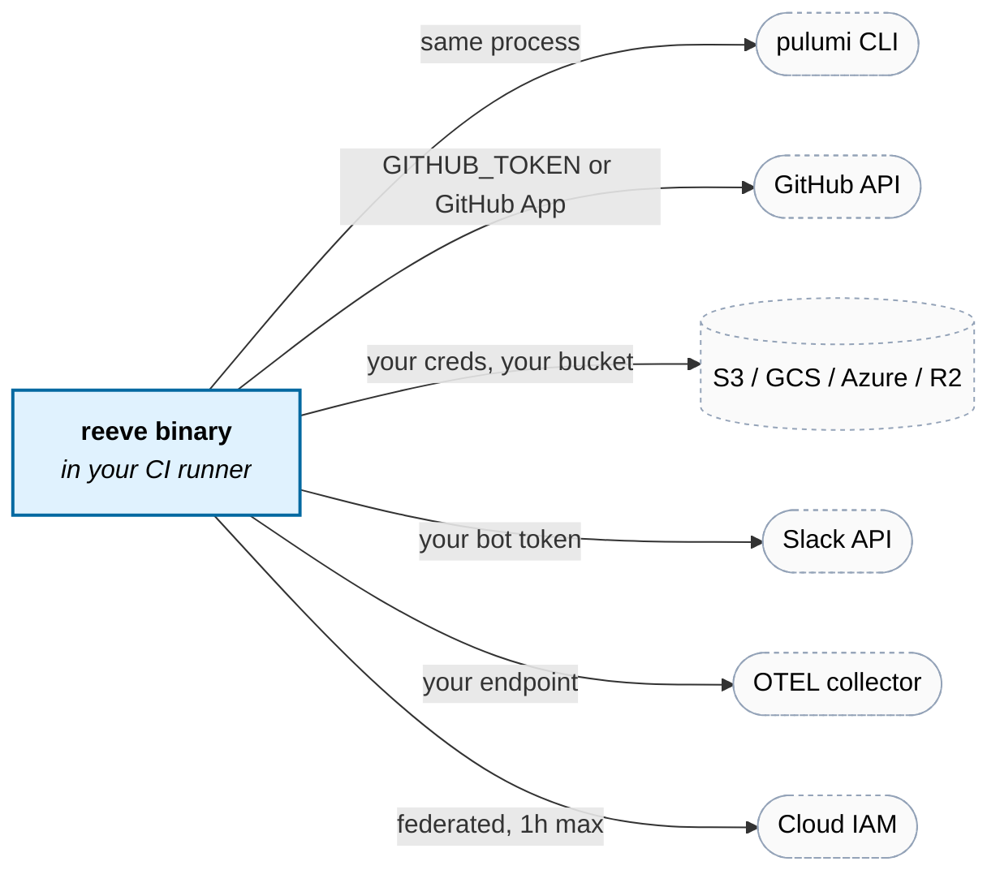

# Self-hosting

reeve is a single Go binary that runs inside your CI. There is no hosted
offering, no control plane, no "free tier with optional backend". This
guide covers what you need to stand up on your side of the trust
boundary.

## What you need

| Component | Purpose | Required? |
|---|---|---|
| Blob storage (S3 / GCS / Azure / R2) | locks, run artifacts, audit, drift state | yes |
| GitHub repo with Actions | reeve runs inside workflows | yes |
| IAM role trusting GitHub's OIDC provider | short-lived creds for IaC | strongly recommended |
| GitHub App | higher rate limits, cross-repo install | optional |
| Slack workspace + bot | PR-scoped notifications + drift channels | optional |
| OTEL collector | traces + metrics | optional |
| PagerDuty / incident system | drift escalation | optional |

**What you never need:** a reeve server, a reeve SaaS account, a reeve
database, or any credential shared with the reeve maintainers. The
binary is hermetic.

## Scope of trust

Each arrow out of the reeve binary crosses **your** trust boundary:



reeve never calls anything reeve-operated. There is nothing reeve-operated.

---

## Bucket provisioning

The bucket holds locks, run artifacts, audit entries, drift state, and
Slack message IDs. Typical lifetime cost is a few MB/month - this is
metadata, not plan bodies.

### AWS S3

```bash
aws s3api create-bucket \
  --bucket mycompany-reeve \
  --create-bucket-configuration LocationConstraint=us-east-1

aws s3api put-bucket-versioning \
  --bucket mycompany-reeve \
  --versioning-configuration Status=Enabled

aws s3api put-public-access-block \
  --bucket mycompany-reeve \
  --public-access-block-configuration \
  "BlockPublicAcls=true,IgnorePublicAcls=true,BlockPublicPolicy=true,RestrictPublicBuckets=true"

# Lifecycle for run artifacts (30d), audit (7y-ish)
aws s3api put-bucket-lifecycle-configuration \
  --bucket mycompany-reeve \
  --lifecycle-configuration file://lifecycle.json
```

`lifecycle.json`:

```json
{
  "Rules": [
    {
      "ID": "run-artifacts",
      "Status": "Enabled",
      "Filter": { "Prefix": "runs/" },
      "Expiration": { "Days": 30 },
      "NoncurrentVersionExpiration": { "NoncurrentDays": 7 }
    },
    {
      "ID": "drift-artifacts",
      "Status": "Enabled",
      "Filter": { "Prefix": "drift/runs/" },
      "Expiration": { "Days": 90 }
    },
    {
      "ID": "audit",
      "Status": "Enabled",
      "Filter": { "Prefix": "audit/" },
      "Transitions": [
        { "Days": 90, "StorageClass": "GLACIER" }
      ],
      "Expiration": { "Days": 2557 }
    }
  ]
}
```

IAM permissions for the reeve role:

```json
{
  "Version": "2012-10-17",
  "Statement": [{
    "Effect": "Allow",
    "Action": [
      "s3:GetObject", "s3:PutObject", "s3:DeleteObject",
      "s3:ListBucket", "s3:GetObjectVersion"
    ],
    "Resource": [
      "arn:aws:s3:::mycompany-reeve",
      "arn:aws:s3:::mycompany-reeve/*"
    ]
  }]
}
```

Config:

```yaml
# .reeve/shared.yaml
bucket:
  type: s3
  name: mycompany-reeve
  region: us-east-1
  prefix: reeve/         # optional - useful if you share a bucket
```

### GCS

```bash
gcloud storage buckets create gs://mycompany-reeve \
  --location=us --uniform-bucket-level-access
gcloud storage buckets update gs://mycompany-reeve --lifecycle-file=lifecycle.json
```

```yaml
bucket:
  type: gcs
  name: mycompany-reeve
```

### Azure Blob

```bash
az storage container create \
  --account-name mycompanyreeve \
  --name reeve \
  --auth-mode login
```

```yaml
bucket:
  type: azblob
  name: reeve                                              # container name
  region: https://mycompanyreeve.blob.core.windows.net     # service URL
```

### Cloudflare R2

R2 is S3-compatible; use `type: r2` (enables path-style + custom endpoint
via `AWS_ENDPOINT_URL_S3`):

```yaml
bucket:
  type: r2
  name: mycompany-reeve
```

Workflow:

```yaml
env:
  AWS_ACCESS_KEY_ID: ${{ secrets.R2_ACCESS_KEY_ID }}
  AWS_SECRET_ACCESS_KEY: ${{ secrets.R2_SECRET_ACCESS_KEY }}
  AWS_ENDPOINT_URL_S3: https://<account>.r2.cloudflarestorage.com
```

(R2 has no OIDC yet, so long-lived R2 keys are one of the few places
env vars are genuinely the only option. Lock them down to the reeve
bucket only.)

### Filesystem (dev only)

```yaml
bucket:
  type: filesystem
  name: ./.reeve-state
```

Good for `plan-run` and local smoke tests. **Not for CI** - Actions
runners start empty, so locks don't persist across runs.

---

## GitHub Actions setup

### Minimum permissions

```yaml
permissions:
  contents: read
  pull-requests: write      # upsert PR comment
  issues: write             # /reeve apply via issue_comment; github_issue drift channel
  id-token: write           # only when using aws_oidc / gcp_wif / azure_federated
```

### Event triggers

reeve expects these events:

- `pull_request` (`opened`, `reopened`, `synchronize`) - fires `preview`
- `pull_request` (`ready_for_review`) - fires `ready` (if `auto_ready: true` and plan succeeded)
- `pull_request` (any other action, e.g. `labeled`, `assigned`, `edited`) - no-op
- `pull_request_review` (`submitted`, state `approved`) - fires `approved` (Slack status update), **only** when the action input `run-on-approval` is `"true"`; skipped by default since the apply gate re-checks approvals anyway
- `issue_comment` (`created`, first word matches a `command-prefix` entry - default `/reeve` or `@reeve` - followed by `apply` (or `up`), `ready`, `preview` (or `plan`), `approve`, or `help`) - fires respective command; comments authored by bots (user type `Bot` or login ending in `[bot]`) are always skipped to prevent self-trigger loops. `approve` fires `approved` (the Slack "ready to apply" refresh) and only counts as an approval when the opt-in `pr_comment` source is enabled in `approvals.sources`; the apply gate re-reads the comment and re-checks `author_association` at apply time
- `schedule` - fires `drift run`
- `workflow_dispatch` - manual re-runs

For run coalescing, use a `concurrency` group keyed per PR with
`cancel-in-progress` limited to preview runs: previews never take apply
locks, so cancelling one loses nothing, while an apply holds per-stack locks
that only the run itself releases - never cancel an apply mid-run. See the
workflow in [getting-started](getting-started.md#4-add-the-github-actions-workflow).

### GitHub App (optional but recommended for multi-repo)

- Rate limits: PATs/`GITHUB_TOKEN` cap at 5K req/hour. Apps get 15K per
  installation, independent of other workflows.
- Attribution: reeve's comments and audit entries show under the App's
  branded identity ("reeve-bot") instead of the workflow's implicit
  identity.
- Cross-repo: one App install covers many repos.

#### 1. Register the App

Go to **Settings → Developer settings → GitHub Apps → New GitHub App**
(user account: `https://github.com/settings/apps/new`; org:
`https://github.com/organizations/<ORG>/settings/apps/new`). Fill in:

- **GitHub App name:** anything unique, e.g. `reeve-bot` - this is the
  identity that posts PR comments.
- **Homepage URL:** your repo URL (required, not otherwise used).
- **Webhook:** uncheck **Active**. reeve is driven by GitHub Actions, not
  by webhooks, so no callback URL is needed.
- **Repository permissions:** Contents `read`, Issues `write`, Metadata
  `read`, Pull requests `write`, Checks `read`.
- **Subscribe to events:** leave unchecked (webhook is off).
- **Where can this App be installed?** Only on this account (keep it
  private unless you're publishing).

Click **Create GitHub App**.

#### 2. Set the App avatar (logo)

On the App's settings page, scroll to **Display information** and upload
an avatar so reeve's PR comments carry a recognizable icon. This repo
ships brand assets in [`docs/`](.):

- [`logo.svg`](logo.svg) - full badge (dark rounded square + hex + key/R).
  Best avatar choice; the dark background reads well as a circular icon.
- [`logo-hex.svg`](logo-hex.svg) - hex + key/R, transparent background.
- [`logo-key.svg`](logo-key.svg) - key/R only, transparent background.

GitHub avatars must be raster (PNG/JPG), so rasterize first, e.g.
`rsvg-convert -w 512 -h 512 docs/logo.svg -o reeve.png`, then upload
`reeve.png`.

#### 3. Collect credentials

- **App ID:** shown at the top of the App settings page → `GITHUB_APP_ID`.
- **Private key:** **Generate a private key** in the App settings;
  downloads a `.pem`. Store it as `GITHUB_APP_PRIVATE_KEY` (literal PEM,
  file path, or base64 - see [auth.md](auth.md#github-app-github_app)).
- **Installation ID:** **Install App** (left nav) → install on the target
  repos/org. After installing, the URL is
  `…/settings/installations/<INSTALLATION_ID>` → `GITHUB_APP_INSTALLATION_ID`.

#### 4. Wire in `.reeve/auth.yaml`:

```yaml
providers:
  github-app:
    type: github_app
    app_id: ${env:GITHUB_APP_ID}
    installation_id: ${env:GITHUB_APP_INSTALLATION_ID}
    private_key: ${env:GITHUB_APP_PRIVATE_KEY}
    permissions: ["contents:read", "issues:write", "pull_requests:write"]

bindings:
  - match: { stack: "**" }
    providers: [github-app]
```

The GitHub App provider emits `GITHUB_TOKEN` into the engine environment,
overriding the workflow's default token.

---

## Distribution

Tagged releases (`vX.Y.Z`) ship per-platform tarballs with a
`checksums.txt` signed via cosign keyless, plus a container image on GHCR
and a Homebrew cask push to `FynxLabs/brew-tap` - all produced by
goreleaser from `.github/workflows/release.yml`. Building from source
(`go build ./cmd/reeve`) always remains supported.

### Pinning and binaries (GitHub Action)

The composite action resolves its binary in three tiers, cache first:

| Pin                 | Binary source                                                                    |
| ------------------- | -------------------------------------------------------------------------------- |
| `@vX.Y.Z`           | Release tarball, verified against the release's cosign-signed `checksums.txt`    |
| `@master` / `@next` | Rolling edge binary from the `edge-<branch>` prerelease, matched to the action's exact source hash (unsigned, auto-fallback to source build) |
| anything else       | Built from source on the runner (SHA pins, branches, forks)                      |

A per-runner cache keyed `reeve-<os>-<arch>-<source hash>` fronts all
three paths; only a cache miss triggers a download or build. The edge
assets are published by `.github/workflows/edge-build.yml` on every push
to `master`/`next` and are named after the source hash they were built
from, so the action can prove an edge binary corresponds to the source it
checked out - no hash match means it silently builds from source instead.
Prebuilt binaries save the ~30s+ Go toolchain + build cost on cache
misses. Edge builds are unsigned; if your supply-chain policy requires
signatures, pin `@vX.Y.Z` (or a commit SHA, which always builds from the
pinned source).

---

## Upgrading

### Binary

Grab the latest release tarball (or `brew upgrade reeve` if you installed
via the cask). CI jobs pick up
new binaries per the pinning table above: `@vX.Y.Z` pins move when you
edit the workflow; `@master`/`@next` pins track each push via edge
binaries (or a source build while the edge build is still running).

### Config schema

Schemas are versioned per-file (not globally). When reeve ships a new
schema version:

```bash
reeve migrate-config --dry-run   # preview changes
reeve migrate-config             # writes + keeps *.bak backups
```

Only files whose `config_type` has a migration land are touched.

---

## Monitoring reeve itself

### Runs failing silently?

Every CI run writes a run manifest to `runs/pr-<n>/<run-id>/manifest.json`.
Tail them with whatever bucket-event tooling you have (S3 EventBridge,
GCS Pub/Sub). An absence of run manifests on expected PRs means the
workflow itself didn't fire - check Actions.

### Drift backlog growing?

```bash
reeve drift status                  # all stacks
reeve drift status --stack prod/*   # specific
```

Or watch the `reeve.drift.stacks_in_drift{env="prod"}` gauge if you've
wired OTEL.

### Lock contention

```bash
reeve locks list                    # shows holder + queue depth
reeve locks explain <project/stack> # detail for one stack
reeve locks unlock <project/stack>  # force-clear one holder, promote its queue
reeve locks unlock <project/stack> --pr N  # remove a closed/abandoned PR instead
reeve locks unlock --pr N           # ...from every lock that PR is in
reeve locks unlock --pr N --force   # ...even a holder whose lease is active (mid-apply)
```

Long queue depths on a stack indicate apply contention - usually a
symptom of too-coarse stack granularity or PRs that take too long to
merge after `/reeve apply`.

Lock holders are identified by **PR + run ID**. A second concurrent run
of the same PR is refused ("another run of this PR holds the lock")
rather than applied in parallel, and only the run that acquired a lock
can release it. A successful apply automatically removes its PR from every lock it
still appeared in; for PRs closed while holding or queued, use
`reeve locks unlock --pr N` so the queue doesn't promote a dead PR - or
comment `/reeve unlock` on the PR itself, which does the same thing
scoped to that PR (add `project/stack` to free just one lock). If the
PR still holds a lock with an active lease - usually an apply mid-run -
the unlock is refused and reeve comments back "this PR is in the middle
of an apply; comment `/reeve unlock --force` if you are sure". Queue
entries are always removed; only an active holder needs `--force`.
Promotion from the queue grants a lease of the configured `locking.ttl`
(default 4h).

`locking.admin_override` gates only the force paths (`locks unlock`
without `--pr`), which can clear other PRs' holders. PR-scoped removal
is self-service: it cannot touch another PR's entries.

### Audit trail

Every apply writes to `audit/<year>/<month>/<day>/<run-id>.json`,
write-once (If-None-Match on create). Ship these to your SIEM with
the same bucket-event tooling.

Schema: see [`internal/audit/audit.go`](../internal/audit/audit.go).
Stable within a major version.

---

## Failure modes

### Bucket unavailable mid-apply

reeve writes lock state → apply runs → writes result. If S3 goes away
between the first two steps, the lock may be held indefinitely from
reeve's perspective. The opportunistic reaper cleans up based on TTL;
wait the configured TTL (default 4h), or use `reeve locks explain` +
`reeve locks reap` once the bucket is back.

### Clock skew

Lock TTL uses server-side timestamps (S3 `LastModified`, GCS `updated`)
when available. The filesystem adapter uses local `time.Now()` and warns
if `acquired_at` drift exceeds 60s. For cloud adapters, TTL accuracy is
the bucket's clock accuracy.

### Fork PRs

Deny-by-default. See [auth.md](auth.md#fork-pr-policy) for the security
rationale and opt-in procedure.

### Supply chain

reeve depends on Go modules, the Pulumi CLI, and cloud SDKs. The
`go.sum` + release checksums pin exactly what goes into the binary.
Vendor the modules (`go mod vendor`) and pin the Pulumi CLI version
in your workflow if you need to cut the supply chain further.

---

## FAQ

**Why no control plane?** Because every "just a small control plane for
X" decision compounds into exactly what reeve is trying to avoid
becoming. Nothing hosted, ever - including a "free tier API".

**What if I want telemetry for usage analytics?** You can add it
yourself in a fork. The upstream code does not contain the feature,
not as a toggle and not as a hook point. If the Slack-style "opt-in
data sharing" ever gets proposed upstream, the proposal will be
rejected.

**What about support?** GitHub issues, best effort. No SLA, no paid
support tier. Pull requests with tests are the fastest path to seeing
fixes.

**Can I relicense my fork?** MIT lets you do anything, including
relicensing a fork. The upstream repo stays MIT under its existing
maintainers.
